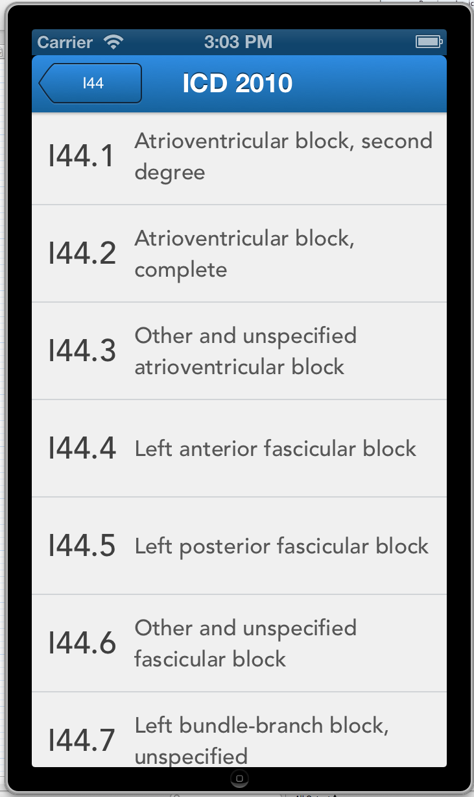
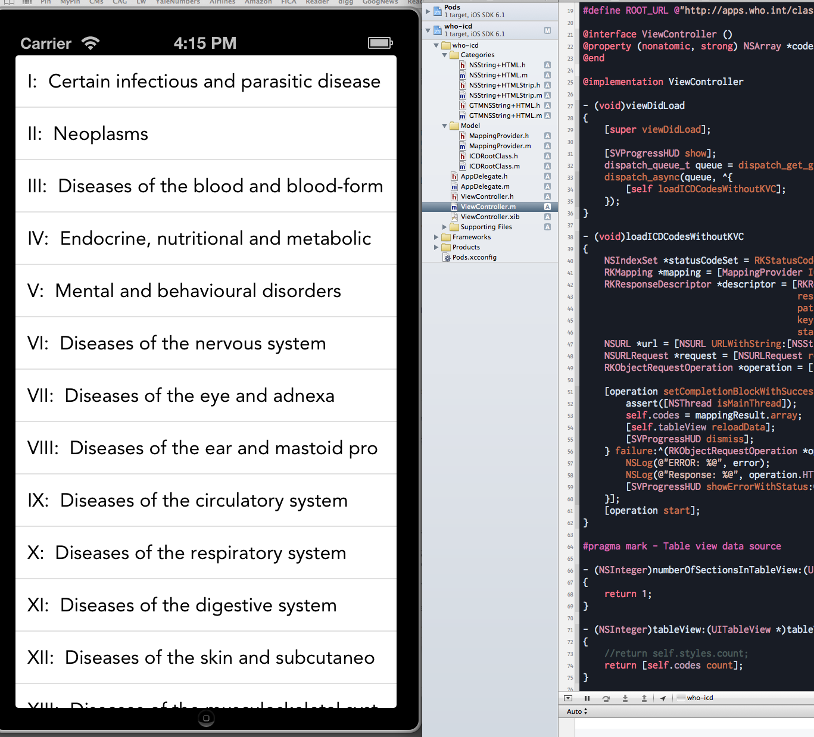

who-icd
=======

- Proof of concept to load then drill down from the root ICD10 codes of the WHO website. 
- Uses RestKit (without PathPattern sadly) into a UITableView while stripping out all that nonsense formatting code.

*Note:* need to run CocoaPods "pod install" prior to build and then load the .xcworkspace.

*Version Notes:*
- [2/7/22:24] Added ability to drill down into subheadings. (No specific diseases yet, but possible to tell when we've reached the bottom by the ID)

*Turns this:*

```[{"ID":"I","html":"\r\n\r\n\u003ca class=\"ygtvlabel \"  href=\"#/I\" \u003e \r\n    \r\n\r\n\r\nCertain infectious and parasitic diseases\r\n\r\n  \r\n\u003c/a\u003e\u0026nbsp;","isLeaf":false,"isAdoptedChild":false,"UseDiffViewMode":true},{"ID":"II","html":"\r\n\r\n\u003ca class=\"ygtvlabel \"  href=\"#/II\" \u003e \r\n    \r\n\r\n\r\nNeoplasms\r\n\r\n    \r\n\u003c/a\u003e\u0026nbsp;","isLeaf":false,"isAdoptedChild":false,"UseDiffViewMode":true},...```

Into this:

  
  
